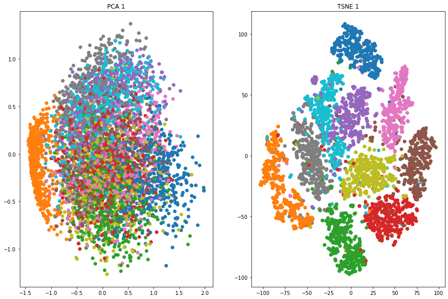
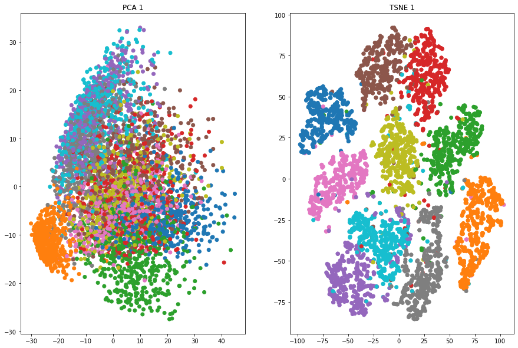

# Exercise - 3: Practical Tasks

### Accuracies

| Learning rate  | Epochs   | Accuracy |
|:--------------:|:--------:|:--------:|
| 1e-6           | 1        | 6%       |
| 1e-3           | 20       | 97%      |

With higher number of epochs (i.e. 20), accuracy of the model increased to 97%. In contrary, when the model is trained for 1 epoch only, accuracy is very low (i.e. 6%).

### PCA and T-SNE

#### Learning rate: 1e-6, epoch: 1:

#### Learning rate: 1e-3, epoch: 20:

### Overall remarks on PCA & T-SNE

