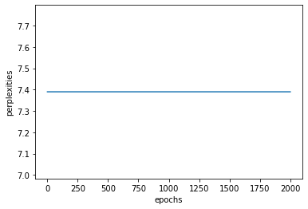

# Exercise - 4: Practical Tasks

## Task 1: Perplexity graph 

Following figure shows the perplexity graph of the Char-RNN based on GRU architecture.

## Task 2: Generated sequences

| Prime sequence | Generated text of length 100                                                                              |
|:------------------------:|:---------------------------------------------------------------------------------------------------------:|
| 2 b3n                    | 2 b3n be the majesty. KING CAPlOM: Good part is my own this eyes my father?                               |
| bg09Z                    | bg09Z Richard, what we the hand, With out for first bootle's be your acquish'd, His shore my very we shal |
| xyz                      | xyzart. GRUMIO: Mener, thou hast feal: To read that 'shelf were in King Henry's face And this we will     |

## Task 3: Generated sequences

| Prime sequence          | Generated text of length 100                                                                                             |
|:-----------------------:|:-------------------------------------------------------------------------------------------------------------------------:|
| The                     | The cut, sir, come out unto him stay; Thou hast false in your husband. ARIEL: We have lent man with my                    |
| What is                 | bg09Z Richard, what we the hand, With out for first bootle's be your acquish'd, His shore my very we shal                 |
| Shall I give            | Shall I give thou abt a king? There is wretched, and that prove all-housin, I'll be a peace. CLIFFORD: Have I c           |
| X087hNYB BHN BYFVuhsdbs | X087hNYB BHN BYFVuhsdbsess: 'Twould Signience of the is the marriage, To ass your repeal'd. I shall have heard. BAPTISTA: |